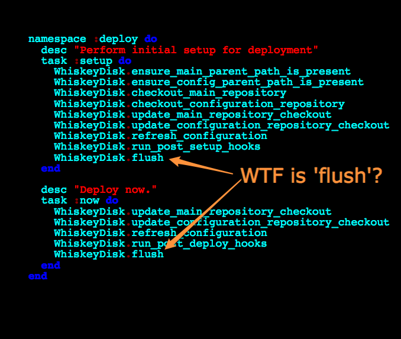

!SLIDE code smallest

	rake tasks
	
	deploy:setup
	- should make changes on the specified domain when a domain is specified
	- should make changes on the local system when no domain is specified
	- should ensure that the parent path for the main repository checkout is present
	
	when a configuration repo is specified
	- should ensure that the parent path for the configuration repository checkout is present

	when no configuration repo is specified
	- should not ensure that the path for the configuration repository checkout is present

	- should check out the main repository

	when a configuration repository is specified
	- should check out the configuration repository

	when no configuration repository is specified
	- should not check out the configuration repository

	- should update the main repository checkout
	
	when a configuration repository is specified
	- should update the configuration repository checkout

	when no configuration repository is specified
	- should update the configuration repository checkout

	when a configuration repository is specified
	- should refresh the configuration

	when no configuration repository is specified
	- should not refresh the configuration
	
	- should run any post setup hooks
	- should flush WhiskeyDisk changes
	

!SLIDE 

<h1>WTF is a config repo?</h1>

!SLIDE full-page

	
	
!SLIDE full-page

	

!SLIDE code smallest

	@@@ruby

	describe 'rake tasks' do
	  before do
	    Rake.application = @rake = Rake::Application.new
	    load rakefile
	    WhiskeyDisk.reset
	  end
	  
	  after do
	    Rake.application = nil
	  end
	  
	  # ...
	  
	  it 'should make changes on the specified domain when a domain is specified' do
	    @configuration = { 'domain' => 'some domain' }
	    WhiskeyDisk::Config.stub!(:fetch).and_return(@configuration)
	    @rake["deploy:setup"].invoke
	    WhiskeyDisk.should.be.remote
	  end
	  
	  # ...
	end
  

!SLIDE code smallest

	@@@ruby
	
	namespace :deploy do
	  desc "Perform initial setup for deployment"
	  task :setup do
	    WhiskeyDisk.ensure_main_parent_path_is_present
	    WhiskeyDisk.ensure_config_parent_path_is_present      if WhiskeyDisk.has_config_repo?
	    WhiskeyDisk.checkout_main_repository
	    WhiskeyDisk.checkout_configuration_repository         if WhiskeyDisk.has_config_repo?
	    WhiskeyDisk.update_main_repository_checkout
	    WhiskeyDisk.update_configuration_repository_checkout  if WhiskeyDisk.has_config_repo?
	    WhiskeyDisk.refresh_configuration                     if WhiskeyDisk.has_config_repo?
	    WhiskeyDisk.run_post_setup_hooks
	    WhiskeyDisk.flush
	  end
	
	  desc "Deploy now."
	  task :now do
	    WhiskeyDisk.update_main_repository_checkout
	    WhiskeyDisk.update_configuration_repository_checkout  if WhiskeyDisk.has_config_repo?
	    WhiskeyDisk.refresh_configuration                     if WhiskeyDisk.has_config_repo?
	    WhiskeyDisk.run_post_deploy_hooks
	    WhiskeyDisk.flush
	  end
	end

!SLIDE full-page

	

!SLIDE code

	@@@ruby
  
	def flush
	  remote? ? run(bundle) : system(bundle)
	end

!SLIDE code smaller

	@@@ruby

	def flush
	  remote? ? run(bundle) : system(bundle)
	end

	def run(cmd)
	  needs(:domain)
	  system('ssh', '-v', self[:domain], "set -x; " + cmd)
	end

!SLIDE code smaller

	@@@ruby

	def flush
	  remote? ? run(bundle) : system(bundle)
	end

	def run(cmd)
	  needs(:domain)
	  system('ssh', '-v', self[:domain], "set -x; " + cmd)
	end

	def bundle
	  return '' if buffer.empty?
	  buffer.collect {|c| "{ #{c} ; }"}.join(' && ')
	end

!SLIDE code smaller

	@@@ruby

	def flush
	  remote? ? run(bundle) : system(bundle)
	end

	def run(cmd)
	  needs(:domain)
	  system('ssh', '-v', self[:domain], "set -x; " + cmd)
	end

	def bundle
	  return '' if buffer.empty?
	  buffer.collect {|c| "{ #{c} ; }"}.join(' && ')
	end
	
	def buffer
	  @buffer ||= []
	end
	
	def enqueue(command)
	  buffer << command
	end

!SLIDE code smallest

	@@@ruby

	def bundle
	  return '' if buffer.empty?
	  buffer.collect {|c| "{ #{c} ; }"}.join(' && ')
	end

	def enqueue(command)
	  buffer << command
	end
	
	def checkout_main_repository
	  needs(:deploy_to, :repository)
	  enqueue "cd #{parent_path(self[:deploy_to])}"
	  enqueue "git clone #{self[:repository]} #{tail_path(self[:deploy_to])} ; true"
	end
	
	def update_main_repository_checkout
	  needs(:deploy_to)
	  enqueue "cd #{self[:deploy_to]}"
	  enqueue "git fetch origin +refs/heads/#{branch}:refs/remotes/origin/#{branch}"
	  enqueue "git reset --hard origin/#{branch}"
	end
  

!SLIDE code smallest

	@@@ruby

	namespace :deploy do
	  desc "Perform initial setup for deployment"
	  task :setup do
	    WhiskeyDisk.ensure_main_parent_path_is_present
	    WhiskeyDisk.ensure_config_parent_path_is_present      if WhiskeyDisk.has_config_repo?
	    WhiskeyDisk.checkout_main_repository
	    WhiskeyDisk.checkout_configuration_repository         if WhiskeyDisk.has_config_repo?
	    WhiskeyDisk.update_main_repository_checkout
	    WhiskeyDisk.update_configuration_repository_checkout  if WhiskeyDisk.has_config_repo?
	    WhiskeyDisk.refresh_configuration                     if WhiskeyDisk.has_config_repo?
	    WhiskeyDisk.run_post_setup_hooks
	    WhiskeyDisk.flush
	  end

	  desc "Deploy now."
	  task :now do
	    WhiskeyDisk.update_main_repository_checkout
	    WhiskeyDisk.update_configuration_repository_checkout  if WhiskeyDisk.has_config_repo?
	    WhiskeyDisk.refresh_configuration                     if WhiskeyDisk.has_config_repo?
	    WhiskeyDisk.run_post_deploy_hooks
	    WhiskeyDisk.flush
	  end
	end

!SLIDE code smaller

	@@@yaml
	
	# config/deploy.yml

	production:
	  domain: "ogc@larry.ogtastic.com"
	  deploy_to: "/opt/ogc/var/www/larry-production.ogtastic.com"
	  deploy_config_to: "/opt/ogc/var/www/project_config"
	  repository: "git://github.com/rick/larry.git"
	  config_repository: "git@ogtastic.com:project_config.git"
	  rake_env:
	    RAILS_ENV: 'production'
	
	staging:
	  domain: "ogc@larry.ogtastic.com"
	  deploy_to: "/opt/ogc/var/www/larry-staging.ogtastic.com"
	  deploy_config_to: "/opt/ogc/var/www/project_config"
	  repository: "git://github.com/rick/larry.git"
	  config_repository: "git@ogtastic.com:project_config.git"
	  rake_env:
	    RAILS_ENV: 'production'

!SLIDE code smaller

	@@@ruby
	
	# lib/tasks/deploy.rake
	
	namespace :deploy do
	  task :create_rails_directories do
	    puts "creating log/ and tmp/ directories"
	    Dir.chdir(RAILS_ROOT)
	    system("mkdir -p log tmp")
	  end

	  task :bounce_passenger do
	    puts "restarting Passenger web server"
	    Dir.chdir(RAILS_ROOT)
	    system("touch tmp/restart.txt")    
	  end

	  task :post_setup => [ :create_rails_directories ]
	  task :post_deploy => [ 'db:migrate', :bounce_passenger ]
	end
	

!SLIDE code smallest

	debug1: 
		Sending command: set -x; { cd /opt/ogc/var/www/larry-production.ogtastic.com ; } && \
	  { git fetch origin +refs/heads/master:refs/remotes/origin/master ; } && \
	  { git reset --hard origin/master ; } && { cd /opt/ogc/var/www/project_config ; } && \
	  { git fetch origin +refs/heads/master:refs/remotes/origin/master ; } && \
	  { git reset --hard origin/master ; } && \
	  { rsync -av .../project_config/larry/production/ .../larry-production.ogtastic.com/ ; } && \
	  { cd /opt/ogc/var/www/larry-production.ogtastic.com ; } && 
	  { RAILS_ENV='production'  rake --trace deploy:post_deploy to=production ; }
	+ cd /opt/ogc/var/www/larry-production.ogtastic.com
	+ git fetch origin +refs/heads/master:refs/remotes/origin/master
	From git://github.com/rick/larry
	   67f3d01..c5ae15c  master     -> origin/master
	+ git reset --hard origin/master
	HEAD is now at c5ae15c adding new version of whiskey_disk
	+ cd /opt/ogc/var/www/project_config
	+ git fetch origin +refs/heads/master:refs/remotes/origin/master
	+ git reset --hard origin/master
	HEAD is now at 42e5dda htpasswd file to lock down larry.ogtastic.com data from prying eyes
	building file list ... 
	6 files to consider
	./
	config/
	+ rsync -av --progress /opt/ogc/var/www/project_config/larry/production/ \
	                       /opt/ogc/var/www/larry-production.ogtastic.com/
	sent 204 bytes  received 32 bytes  472.00 bytes/sec
	total size is 672  speedup is 2.85
	+ cd /opt/ogc/var/www/larry-production.ogtastic.com
	+ RAILS_ENV=production
	+ rake --trace deploy:post_deploy to=production
	restarting Passenger web server

!SLIDE code smaller

# how big is this? (twss)
### [ at least according to `wc -l` ]

	   1 ./init.rb
	   5 ./install.rb
	  36 ./lib/tasks/deploy.rb
	  52 ./lib/whiskey_disk/config.rb
	 130 ./lib/whiskey_disk.rb
   	   2 ./tasks/deploy.rake
	   9 ./spec/init_spec.rb
	  42 ./spec/install_spec.rb
	   5 ./spec/spec_helper.rb
	 255 ./spec/tasks/deploy_spec.rb
	 137 ./spec/whiskey_disk/config_spec.rb
	 482 ./spec/whiskey_disk_spec.rb
	1156 total

!SLIDE code small

# how fast is this? (twss?)
### [ by completely arbitrary metric of the original slow deployment ]

	before:  8+ minutes
	after:   15-45 seconds(*)

(*) from India, with the bulk of time allocated to reindexing sphinx indexes

	typically: 8-15 seconds for a normal deployment

!SLIDE

# wins:

### fast, supports local deployments, configuration separate from code, truly uses unmodified rake, YAML configuration, simple & clean code, fully TDD, fast test suite

!SLIDE

# next:

### multi-project .yml file, even easier deployments for non-ruby projects, git-deploy inspired .changed?('db/migrate/') rake helper hooks, pre_deploy tasks?, rollbacks?, multi-server deploys?, per-environment post_deploy rake tasks?