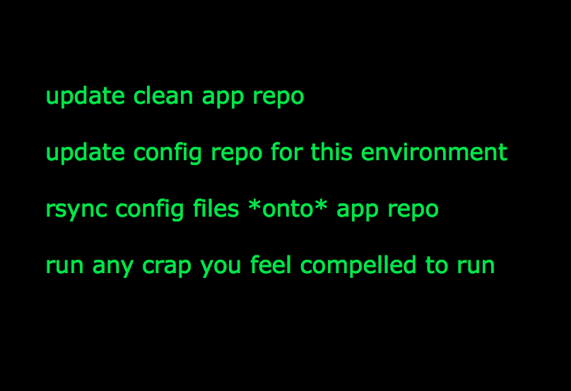

!SLIDE larger

two operations: setup and deploy

!SLIDE larger

use simple shell primitives to build a single command to run via a single SSH connection

!SLIDE larger

why track entire repos on target?  just track the branch of interest

!SLIDE larger

git reset instead of copying files around

!SLIDE larger

configuration data is just YAML

!SLIDE larger

post-setup and post-deploy hooks are just rake tasks

!SLIDE larger

works with anything, not just ruby apps

!SLIDE larger

supports separate configuration repo for data which varies from staging to production (for example)

!SLIDE larger

i.e., symlinking shit around is stupid

!SLIDE larger

supports local deployments, not just remote

!SLIDE larger

I have mirrors of different deployments of the same application on my laptop

!SLIDE larger

staleness checking, suitable for running under cron (get the developer out of the deployment loop!)

!SLIDE larger

continuous deployments

!SLIDE larger

local dependencies:  ruby, rake, ssh, rsync
 
 
remote dependencies:  bash-compatible shell, ruby/rake (only if you want to run post-* hooks)

!SLIDE 

<h1>WTF is a config repo?</h1>

!SLIDE full-page

	
	
!SLIDE full-page

	

!SLIDE larger

different AWS key files for production and staging

!SLIDE larger

hoptoad config only in production

!SLIDE larger

anything in config/initializers/ could vary by target

!SLIDE larger

developers can manage configuration for all targets other than production

!SLIDE larger

but only one deployment manager has to know encryption keys, AWS keys, etc.

!SLIDE larger

in fact, that data could be in a completely separate git repository

!SLIDE code smallest

	@@@ruby
	
	namespace :deploy do
	  desc "Perform initial setup for deployment"
	  task :setup do
	    WhiskeyDisk.ensure_main_parent_path_is_present
	    WhiskeyDisk.ensure_config_parent_path_is_present      if WhiskeyDisk.has_config_repo?
	    WhiskeyDisk.checkout_main_repository
	    WhiskeyDisk.checkout_configuration_repository         if WhiskeyDisk.has_config_repo?
	    WhiskeyDisk.update_main_repository_checkout
	    WhiskeyDisk.update_configuration_repository_checkout  if WhiskeyDisk.has_config_repo?
	    WhiskeyDisk.refresh_configuration                     if WhiskeyDisk.has_config_repo?
	    WhiskeyDisk.run_post_setup_hooks
	    WhiskeyDisk.flush
	  end

	  desc "Deploy now."
	  task :now do
	    WhiskeyDisk.enable_staleness_checks
	    WhiskeyDisk.update_main_repository_checkout
	    WhiskeyDisk.update_configuration_repository_checkout  if WhiskeyDisk.has_config_repo?
	    WhiskeyDisk.refresh_configuration                     if WhiskeyDisk.has_config_repo?
	    WhiskeyDisk.run_post_deploy_hooks
	    WhiskeyDisk.flush
	  end
	end

!SLIDE code smaller

	# config/deploy.yml

	production:
	  domain: "ogc@larry.ogtastic.com"
	  deploy_to: "/opt/ogc/var/www/larry-production.ogtastic.com"
	  deploy_config_to: "/opt/ogc/var/www/project_config"
	  repository: "git://github.com/rick/larry.git"
	  config_repository: "git@ogtastic.com:project_config.git"
	  rake_env:
	    RAILS_ENV: 'production'
	
	staging:
	  domain: "ogc@larry.ogtastic.com"
	  deploy_to: "/opt/ogc/var/www/larry-staging.ogtastic.com"
	  deploy_config_to: "/opt/ogc/var/www/project_config"
	  repository: "git://github.com/rick/larry.git"
	  config_repository: "git@ogtastic.com:project_config.git"
	  rake_env:
	    RAILS_ENV: 'production'

!SLIDE code smaller

	@@@ruby
	
	# lib/tasks/deploy.rake
	
	namespace :deploy do
	  task :create_rails_directories do
	    puts "creating log/ and tmp/ directories"
	    Dir.chdir(RAILS_ROOT)
	    system("mkdir -p log tmp")
	  end

	  task :bounce_passenger do
	    puts "restarting Passenger web server"
	    Dir.chdir(RAILS_ROOT)
	    system("touch tmp/restart.txt")    
	  end

	  task :post_setup => [ :create_rails_directories ]
	  task :post_deploy => [ 'db:migrate', :bounce_passenger ]
	end
	

!SLIDE code smallest

	debug1: 
		Sending command: set -x; { cd /opt/ogc/var/www/larry-production.ogtastic.com ; } && \
	  { git fetch origin +refs/heads/master:refs/remotes/origin/master ; } && \
	  { git reset --hard origin/master ; } && { cd /opt/ogc/var/www/project_config ; } && \
	  { git fetch origin +refs/heads/master:refs/remotes/origin/master ; } && \
	  { git reset --hard origin/master ; } && \
	  { rsync -av .../project_config/larry/production/ .../larry-production.ogtastic.com/ ; } && \
	  { cd /opt/ogc/var/www/larry-production.ogtastic.com ; } && 
	  { RAILS_ENV='production'  rake --trace deploy:post_deploy to=production ; }
	+ cd /opt/ogc/var/www/larry-production.ogtastic.com
	+ git fetch origin +refs/heads/master:refs/remotes/origin/master
	From git://github.com/rick/larry
	   67f3d01..c5ae15c  master     -> origin/master
	+ git reset --hard origin/master
	HEAD is now at c5ae15c adding new version of whiskey_disk
	+ cd /opt/ogc/var/www/project_config
	+ git fetch origin +refs/heads/master:refs/remotes/origin/master
	+ git reset --hard origin/master
	HEAD is now at 42e5dda htpasswd file to lock down larry.ogtastic.com data from prying eyes
	building file list ... 
	6 files to consider
	./
	config/
	+ rsync -av --progress /opt/ogc/var/www/project_config/larry/production/ \
	                       /opt/ogc/var/www/larry-production.ogtastic.com/
	sent 204 bytes  received 32 bytes  472.00 bytes/sec
	total size is 672  speedup is 2.85
	+ cd /opt/ogc/var/www/larry-production.ogtastic.com
	+ RAILS_ENV=production
	+ rake --trace deploy:post_deploy to=production
	restarting Passenger web server

!SLIDE code smaller

# how big is this? (twss)
### [ at least according to `wc -l` ]

       1 ./init.rb
       5 ./install.rb
     124 ./lib/whiskey_disk/config.rb
      37 ./lib/whiskey_disk/rake.rb
     200 ./lib/whiskey_disk.rb
     367 total

!SLIDE code smaller

       9 ./spec/init_spec.rb
      42 ./spec/install_spec.rb
     420 ./spec/wd_command_spec.rb
     492 ./spec/whiskey_disk/config_spec.rb
     261 ./spec/whiskey_disk/rake_spec.rb
     793 ./spec/whiskey_disk_spec.rb
    2017 total

!SLIDE code small

# how fast is this? (twss?)
### [ by completely arbitrary metric of the original slow deployment ]

	before:  8+ minutes
	after:   15-45 seconds(*)

(*) from India, with the bulk of time allocated to reindexing sphinx indexes

	typically: 8-15 seconds for a normal deployment

!SLIDE

# wins:

### super duper frickin' fast, supports local deployments, configuration separate from code, truly uses unmodified rake, YAML configuration, simple & clean code, fully TDD, lightning fast test suite

!SLIDE

# recent: 

### staleness checks, don't have to have ruby or rake on target, using git-flow for release / feature management

# next:

### post-setup/post-deploy shell script ("bundle install --relock --unlock --force --wtf")
 
 
### multi-project .yml file, git-deploy inspired .changed?('db/migrate/') rake helper hooks, pre_deploy tasks?, rollbacks?, multi-server deploys?