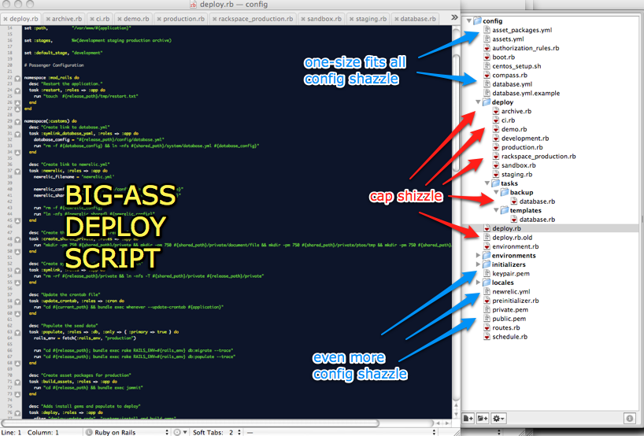
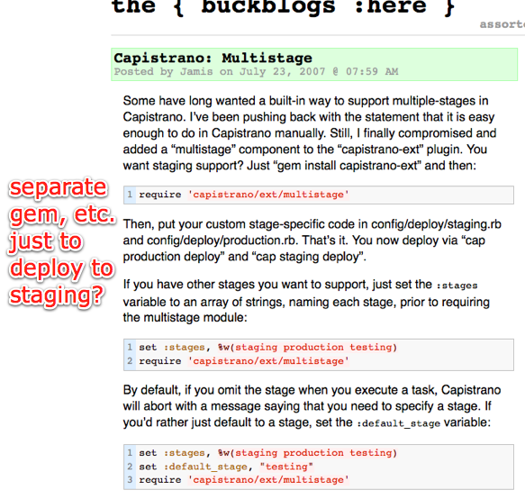
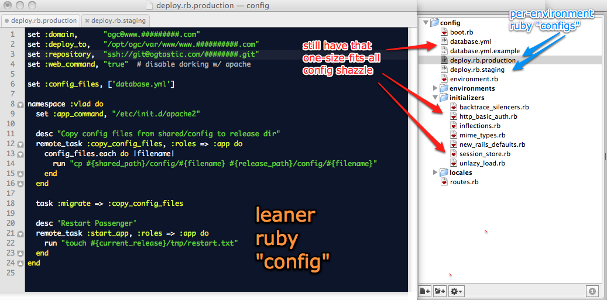
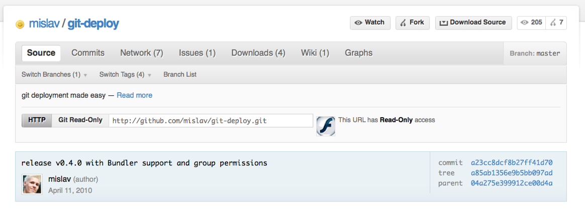
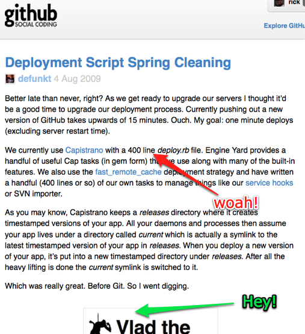

!SLIDE larger

Whiskey\_disk

is a ruby tool 

for deployments

!SLIDE larger

Why didn't I just use capistrano?

!SLIDE code

<blockquote>
"Everything is hosted with EngineYard

For deploys I do

cap staging deploy

or

cap staging deploy:long # for migrations of course.

The app takes a while to restart, so for production I do

cap production deploy:update deploy:web:disable deploy:restart \
  deploy:cleanup ; sleep 15 ; cap production deploy:web:enable

or

cap production deploy:update deploy:web:disable deploy:migrate \
  deploy:restart deploy:cleanup ; sleep 20 ; \
  cap production deploy:web:enable"
</blockquote>

!SLIDE code

<blockquote>
"Everything is hosted with EngineYard

For deploys I do

cap staging deploy

or

cap staging deploy:long # for migrations of course.

The app takes a while to restart, so for production I do

cap production deploy:update deploy:web:disable deploy:restart \
  deploy:cleanup ; sleep 15 ; cap production deploy:web:enable

or

cap production deploy:update deploy:web:disable deploy:migrate \
  deploy:restart deploy:cleanup ; sleep 20 ; \
  cap production deploy:web:enable"
</blockquote>

!SLIDE code

<blockquote>
"Everything is hosted with EngineYard

For deploys I do

cap staging deploy

or

cap staging deploy:long # for migrations of course.

The app takes a while to restart, so for production I do

cap production deploy:update deploy:web:disable deploy:restart \
  deploy:cleanup ; sleep 15 ; cap production deploy:web:enable

or

cap production deploy:update deploy:web:disable deploy:migrate \
  deploy:restart deploy:cleanup ; sleep 20 ; \
  cap production deploy:web:enable"
</blockquote>

!SLIDE full-page

!SLIDE full-page

!SLIDE full-page

!SLIDE full-page

!SLIDE larger

Why didn't I just use vlad?

!SLIDE transition=uncover

!SLIDE transition=scrollUp

 
 

* Do the simplest thing that could possibly work.
* Nothing to 1.0 in four(ish) days.
* Targets the 80% use case.
* Uses Rake, as god intended.
* Use the right tool for the job (ssh, rsync, etc).
* Fold in the Rails Machine recipes.
* Clever is bad. Period.

!SLIDE transition=scrollUp

 
 

* Full deployment automation stack.
* Only 3 mandatory variables to set.
* Turnkey deployment for mongrel+apache+svn.
* Very few dependencies. All simple.
* Uses ssh with your ssh settings already in place.
* Uses rsync for efficient transfers.
* Exec remote commands on one or more servers.
* Syncs files to one or more servers.
* Mix and match local and remote tasks.
* Built on rake. Easy!
* Test driven design. Runs in 0.02 seconds.
* Engine is under 500 lines of code.
* Super uper simple.

!SLIDE full-page

!SLIDE full-page

!SLIDE full-page

!SLIDE full-page

!SLIDE full-page

!SLIDE full-page

!SLIDE commandline incremental

    $ time rake vlad:deploy to=staging

    [ ... churn churn churn ... ]
    real	8m32.012s

    $ man how_long_until_my_shitty_cdma_connection_fails

    [ ... churn churn churn ... ]

		"Between 6 and 7 minutes, on this train."

    $ asdfgjkagg90g4#%$@gskd
    
		-bash: asdfgjkagg90g4#%gskd: command not found

!SLIDE 

!SLIDE 

!SLIDE 

 
 
 

<ul class="goodlist">
<li> 'git push' to deploy </li>
<li> lots of cool ideas </li>
<li>  read the code and enjoy it </li>
</ul>

!SLIDE full-page

